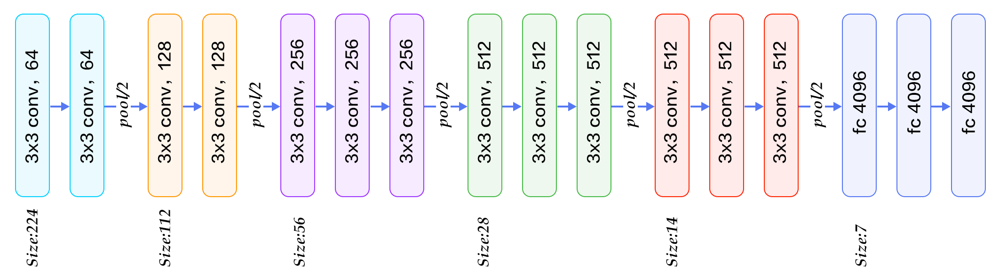
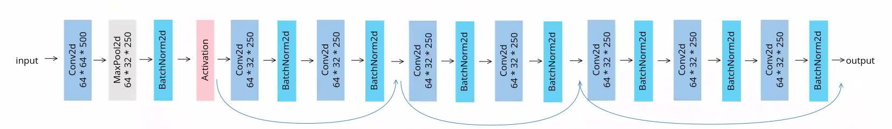
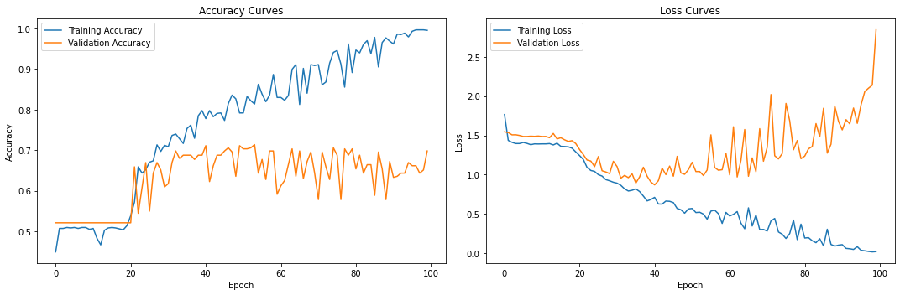
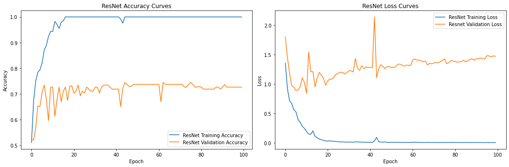

# Music Emotion Recognition Project
Lingxiao Fang (ID: s5614279)

## Abstract
In recent years, it has been considered as an important research field to discover emotion content from audio signals and identify emotion from all kinds of audio. With the advancement of deep learning technology, music emotion recognition (MER) has seen significant progress. In this project, I leverage two different deep neural networks to implement music emotion recognition and summarize the result of two models. 

## Introduction
Music emotion recognition has attracted widespread attention in the academic and industrial community since it can be widely used in fields like recommendation systems, automatic music composing, psychotherapy, music visualisation, etc. In this project, I employ deep neural networks to process audio data, specifically converting audio files into Mel spectrograms. Unlike traditional machine learning approaches that necessitate manual feature extraction, deep learning models such as TinyVGG Model and Residual Networks (ResNet) can automatically learn and classify music genres from these spectrograms without learning a large number of features.

Music emotion recognition has attracted widespread attention in the academic and industrial community since it can be widely used in fields like recommendation systems, automatic music composing, psychotherapy, music visualisation, etc. (Han et al. 2022)

Music emotion recognition is a sub-task of music information retrieval (MIR), which belongs to the interdisciplinary research field of Natural Language Processing. It can be categorised into two research directions, namely song-level MER (or static) and Music Emotion Variation Detection (MEVD, or dynamic) research directions. Song-level MER can be seen as considered a categorical task. For traditional machine learning, features of the audio signal, such as pitch, rhythm, volume, etc. are needed for Emotion Detection and Analysis (EDA). Different emotions will show relatively obvious different features. It can be trained using classification models by matching different emotions with these features. Recently, Deep Learning techniques have been proposed as an alternative to traditional techniques in Speech Emotion Recognition.

General emotion models are of importance in music emotion recognition. Thay can be categorized into “Categorical” and “Dimensional”. Categorical emotion models label emotions as “happy”, “sad”, etc. Dimensional emotion models have been used more recently because they are more accurate. 

In this project, I employ deep neural networks to process audio data. The audio files are converted into Mel spectrograms. Unlike traditional machine learning approaches that necessitate manual feature extraction, deep learning models such as TinyVGG Model and Residual Networks (ResNet) can automatically learn and classify music genres from these spectrograms without learning a large number of features. For the datasets, two different music emotion recognition datasets, Deam (Soleymani et al. 2016) and PMEmo, have been used in the training to get a better result.

## Datasets
For the datasets, I chose the one using Dimensional Emotion Models. Moreover, they have both dynamic and static annotations. However, to show the results of emotion recognition more clearly, I categorized the results into two nine different emotions. When identifying emotions, I use static recognition.
### MediaEval Database for Emotional Analysis in Music Dataset (DEAM)
This is a dataset created by Soleymani et al. It contains royalty-free music from several sources: freemusicarchive.org (FMA), jamendo.com, and the medleyDB dataset. The excerpts which were annotated are available in the same package song ids between 1 and 2058. The dataset consists of 2014 development set (744 songs), 2014 evaluation set (1000 songs) and 2015 evaluation set (58 songs). Includes rock, pop, soul, blues, electronic, classical, hip-hop, international, experimental, folk, jazz, country and pop genres.
### PMEmo
PMEmo is a relatively new music emotion dataset created by Zhang et al. The authors gathered songs popular all around the world: the Billboard Hot 100, the iTunes Top 100 Songs (USA), and the UK Top 40 Singles Chart. They obtained songs available from these charts from 2016 to 2017. Similar to DEAM, the annotation was done with the slider to collect dynamic annotations at a sampling rate of 2 Hz. Additionally, annotators should make a static annotation for the whole music excerpt on nine-point scale after finishing dynamic labelling. A total of 457 subjects (236 females and 221 males) are recruited to participate in this work. The electrodermal activity was sampled continuously at a sampling rate of 50 Hz.

## Model Description
Deep learning obviates the need for manual feature extraction, allowing neural networks to autonomously learn intricate patterns from high-dimensional data. For music classification, I have chosen two deep learning models: `TinyVGG`  and `Residual Networks` (ResNets).

### TinyVGG
TinyVGG_Model is a convolutional neural network (CNN) with a structure similar to a simplified version of the VGG model. It uses a series of 3x3 convolutional and pooling layers to gradually reduce the spatial dimension of the feature map while increasing the number of channels. This simple and regular design makes VGG easy to understand and implement. The architectural design of VGG is simple and clear, easy to understand and implement. Its depth and use of small convolution kernels improve the expressiveness and performance of the network. VGG is widely used in various computer vision tasks, such as image classification, object detection, and semantic segmentation. (Simonyan and Zisserman 2014)

### ResNet
To mitigate the gradient vanishing problem frequently encountered in deep CNN models, I employ the ResNet architecture. Residual connectivity is a key innovation in ResNets, allowing the network to bypass one or more layers and directly propagate input to deeper layers. This design enables the network to achieve considerable depth without suffering from gradient vanishing. The ResNet model consists of an initial convolutional layer, batch normalization, max-pooling, and ReLU activation. It further includes multiple stages of residual blocks, each comprising two convolutional layers with batch normalization and ReLU activation, as well as shortcut connections for downsampling when necessary. The model culminates in adaptive average pooling and a fully connected layer. This design, inspired by standard ResNet architectures, optimizes for deep networks and efficient training, rendering it suitable for complex classification tasks. Additionally, the script calculates both total and trainable parameters, providing insights into the model's complexity and capacity.The figure below provides the  architecture the ResNet network.

## Result and Discussion
After training the TinyVGG model, which have suffered from the common issue of gradient vanishing in deep networks, the accuracy results is lower than 0.70. In contrast, the ResNet architecture's ability to mitigate this problem and reach an accuracy of 0.72 highlights its suitability for deep and complex tasks like MER. The results demonstrate that the ResNet model outperforms the VGG model significantly in terms of accuracy. This substantial performance difference suggests that the ResNet architecture is more effective in capturing complex features and patterns within the mel spectrograms of music tracks, contributing to better genre classification. 

The superior performance of both deep learning models compared to traditional machine learning methods underscores the advantage of utilizing deep neural networks in MER. These models can autonomously learn intricate patterns and representations from raw audio data, eliminating the need for manual feature extraction, which is a time-consuming and error-prone process.

## Conclusion
In conclusion, this project demonstrates the potential of deep learning, particularly the ResNet architecture. MER is still in the early stage of development. For this project, I believe that certain aspects could still be improved, such as a range of boosting algorithms that could be used to improve the performance of the model, and data augmentation technology. I hope that I can implement each of these ideas in subsequent research.

## References
Han, D., Kong, Y., Han, J. and Wang, G., 2022. A survey of music emotion recognition. Frontiers of Computer Science, 16 (6), 166335.

Simonyan, K. and Zisserman, A., 2014. Very deep convolutional networks for large-scale image recognition. arXiv preprint arXiv:1409.1556.

Soleymani, M., Aljanaki, A. and Yang, Y. H., 2016. DEAM: Mediaeval database for emotional analysis in music. Geneva, Switzerland.

Zagoruyko, S. and Komodakis, N., 2016. Wide residual networks. arXiv preprint arXiv:1605.07146.

Zhang, K., Zhang, H., Li, S., Yang, C. and Sun, L., The PMEmo dataset for music emotion recognition (pp. 135-142).

